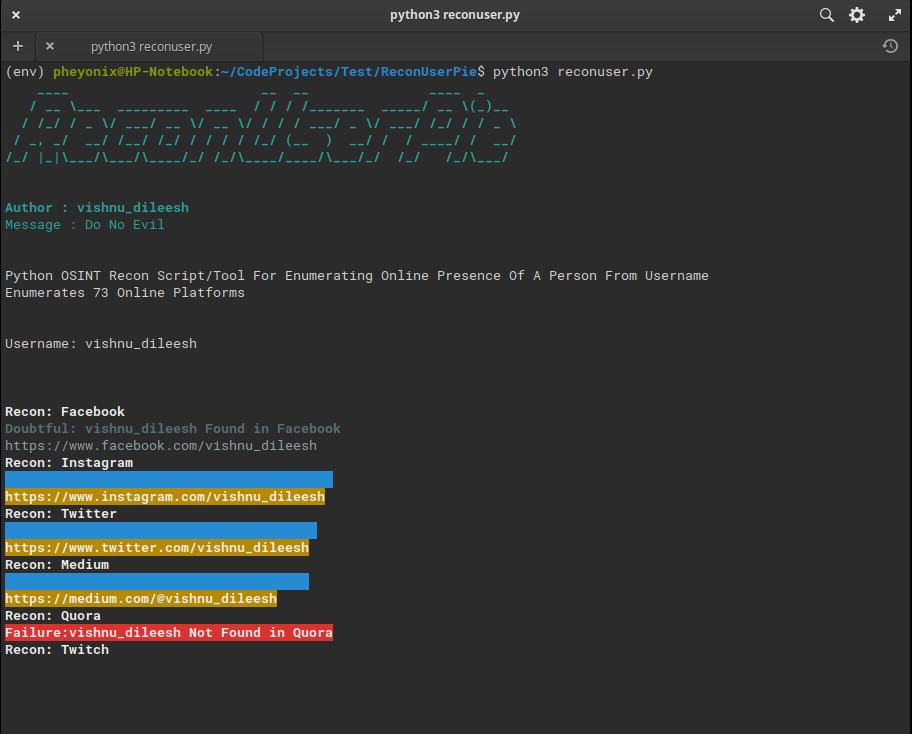

# ReconUserPie
Python OSINT Username Recon Script For Enumerating Online Presence Of A Person From Username

---
## Usage

> Clone the Git Repository

`$ git clone https://github.com/VishnuDileesh/ReconUserPie.git`

> Change to the cloned Repository folder

`$ cd ReconUserPie`

> Install the necessary packages

`$ pip3 install -r requirements.txt`

## Tool outputs 4 types of results

* Success : Username is successfully found on the platform

* Failure : Username is not found on the platform

* Doubtful : Tool is not confident about the result, please do manual check

* Error : Unable to connect, might be caused by the network issue or site being down

## Run the script ( Does all platforms search & outputs all the above result types )

`$ python3 reconuser.py`

> Enter the username in the prompt & press enter

`$ Username:`

> Script will start the enumeration & ones done the success results will be stored in the same folder as:

`vishnu_dileesh_success_report.txt`

## Run the script in min-search mode ( Excludes doubtful platforms )

`$ python3 reconuser.py -f ms`

> Enter the username in the prompt & press enter

`$ Username:`

> Script will start the enumeration & ones done the success results will be stored in the same folder as:

`vishnu_dileesh_success_report.txt`

## Script Running Screenshot

## Legal Disclaimer

The tool/script ReconUserPie was built with good intentions for use in legal OSINT Research purposes. It's the end user's responsibility to obey all applicable local, state and federal laws. I assume no liability and are not responsible for any misuse or damage caused by this program. Only use for educational purposes.
